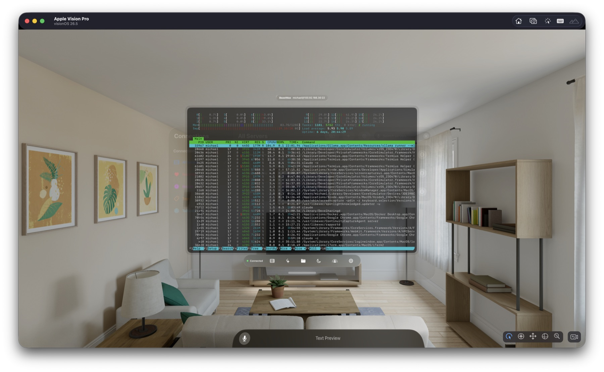
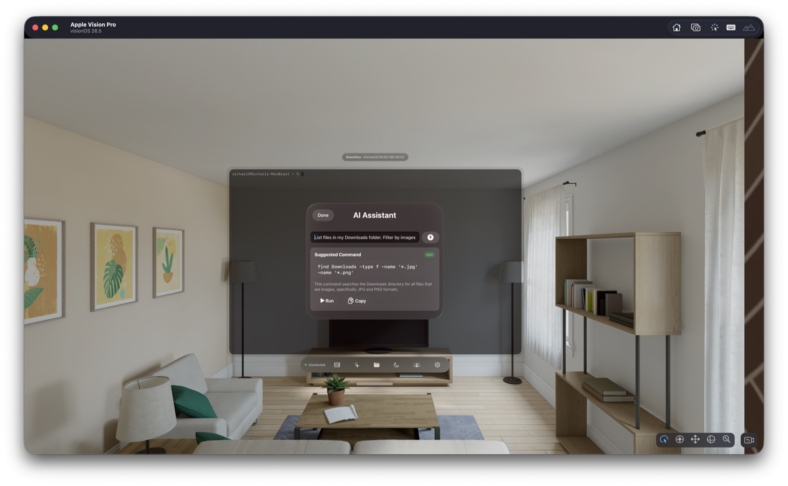
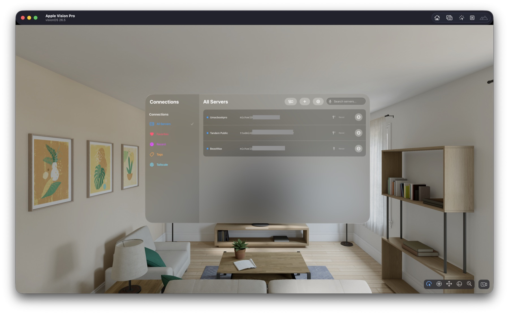
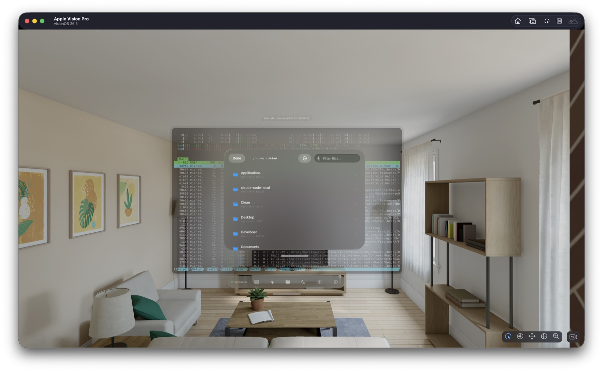

# glas.sh

**The SSH terminal that Apple Vision Pro deserves.**

A native visionOS terminal built from scratch for spatial computing. Float truly transparent terminal windows in your space, then tune opacity and blur independently. AI runs privately on your device. Connect to your Tailscale network, transfer files, and record sessions without a subscription.

**[glas.sh](https://glas.sh)** &nbsp;|&nbsp; **[GitHub Sponsors](https://github.com/sponsors/msitarzewski)** &nbsp;|&nbsp; **MIT Licensed**

<p align="center">
  
  <br>
  <em>A live <code>htop</code> session floating in your space — full PTY, truecolor, glass ornament controls.</em>
</p>

> [!WARNING]
> **Pre-alpha.** glas.sh is under active development and **not yet released on the App Store**. It builds and runs on Apple Vision Pro today, but expect rough edges, incomplete features, and breaking changes between updates. Bug reports and feedback are very welcome — [open an issue](https://github.com/msitarzewski/glas.sh/issues).

---

<p align="center">
<em>If glas.sh saves you time or brings you joy, consider <a href="https://github.com/sponsors/msitarzewski">sponsoring the project</a>.</em>
</p>

---

## Why glas.sh

Every other SSH client on visionOS is a port from iPad. glas.sh is purpose-built for spatial computing — designed for eye-and-hand interaction, glass-first UI, and features that only make sense when your terminal floats in 3D space.

| | glas.sh | La Terminal | Prompt 3 | Termius |
|---|:---:|:---:|:---:|:---:|
| **Native visionOS** | **Yes** | Yes | No | No |
| **On-device AI** | **Foundation Models** | Cloud API | No | No |
| **Tailscale auto-discovery** | **Yes** | No | No | No |
| **Immersive focus mode** | **Yes** | No | No | No |
| **Session recording** | **Yes** | No | No | No |
| **Spatial widgets** | **Yes** | No | No | No |
| **SFTP with batch ops + search** | **Yes** | Basic | No | Yes |
| **Remote + SOCKS forwarding** | **Yes** | No | No | Yes |
| **Multi-hop jump hosts** | **Yes** | No | No | Yes |
| **True Secure Enclave signing** | **Yes** | No | No | No |
| **Open source** | **MIT** | No | No | No |

---

## Features

### Terminal

Full PTY interactive sessions with ANSI/truecolor rendering via SwiftTerm. Dynamic resize, cursor styles, visual + audio bell, in-terminal search, and command snippets with usage tracking. Per-session window overrides for opacity, glass material density, and color tint. Keyboard stays active — a focus maintenance system prevents visionOS from silently dropping input after idle.

### AI — Private, On-Device

Powered by Apple's Foundation Models framework. Everything runs on your Vision Pro. Nothing leaves your device.

- **Command Assistant** — describe what you want in plain English, get a shell command with risk assessment (safe / moderate / destructive)
- **Error Explainer** — automatically detects errors in terminal output and shows a floating card with diagnosis + suggested fix

<p align="center">
  
  <br>
  <em>Plain English in, a risk-rated shell command out — running entirely on-device.</em>
</p>

### Tailscale Integration

Connect your entire Tailscale network. Enter your API key or OAuth credentials once, and glas.sh discovers every device on your tailnet. Tap a device, enter SSH credentials, and you're in. Mobile devices (iOS, iPadOS, Android) are automatically filtered out.

### Connections

Server management with favorites, tags, search, and recent connections. Quick connect bar parses `user@host:port` on the fly. Host key verification with fingerprint display. Layout presets reopen saved groups of server sessions — open your production stack with one tap.

<p align="center">
  
  <br>
  <em>Connections: favorites, recents, tags, and one-tap Tailscale discovery in a glass sidebar.</em>
</p>

### Port Forwarding

- **Local (-L)** — bind a local port, tunnel through SSH to a remote target
- **Remote (-R)** — server listens on a remote port, forwards back through the tunnel
- **Dynamic/SOCKS (-D)** — full SOCKS5 proxy with IPv4, domain name, and IPv6 address support

### Jump Hosts

Single-hop or multi-hop chains. Configure A → B → C with a reorderable hop list. Cycle detection prevents infinite loops. Backward compatible with single-hop configurations.

### SFTP File Browser

Full directory browsing with breadcrumb navigation. Tap files to select, batch download or delete, pick your destination folder first then stream with progress. File info sheet shows permissions, uid/gid, timestamps, and raw listing. Show/hide hidden files. Client-side filter for the current directory, or press Return to run `find` on the server via SSH for deep recursive search.

<p align="center">
  
  <br>
  <em>The SFTP browser opens right over your session — breadcrumbs, filtering, and batch transfers.</em>
</p>

### Security

- **True Secure Enclave signing** — P-256 keys generated inside the hardware chip. The private key never exists in memory. Signing happens in silicon.
- **User presence** authentication before Secure Enclave key use
- **Keychain** storage with terminal-specific, purpose-namespaced credential accounts
- **Host key trust** with per-server fingerprint tracking
- RSA SHA-2 and Ed25519 imported-key support, hardware-bound Secure Enclave P-256 signing keys, and migration support for legacy device-wrapped exportable keys

### Spatial Features

- **Immersive Focus Mode** — dims the passthrough for distraction-free terminal work. Digital Crown controls depth.
- **Spatial Widgets** — recent-server widget (small + medium sizes) with tap-to-connect deep links via `glassh://` URL scheme
- **Notification Overlays** — in-window banners for connection events. Auto-dismiss after 4 seconds, max 3 visible.
- **Glass Material** — choose from ultraThin, thin, regular, or thick material density. Per-session overrides.
- **Color Tint** — preset swatches + full color picker for window tinting

### Session Recording

Asciicast v2 format (NDJSON), compatible with [asciinema](https://asciinema.org). Recording is output-only by default; input capture requires explicit consent for each recording and stays visibly disclosed while active. Recordings are protected on disk and stop at a 512 MiB safety limit.

### Auto-Reconnect

Exponential backoff (1s → 2s → 4s → 8s → 16s, up to 5 attempts). Cancel button in the connection label ornament. Keepalive timer with failure-based timeout detection — no more false disconnects from idle sessions.

---

## Architecture

```
glas.sh/                          Native visionOS 26 app
├── Models.swift                  SSH sessions, connections, server config
├── TerminalWindowView.swift      Terminal UI with glass ornaments
├── ConnectionManagerView.swift   Server list, Tailscale, layouts
├── AIAssistant.swift             Foundation Models command and error assistance
├── SessionRecorder.swift         Asciicast v2 recording engine
├── TailscaleClient.swift         Tailscale REST API v2 + OAuth
├── FocusEnvironmentView.swift    Immersive focus environment
├── NotificationOverlay.swift     In-window notification banners
├── SFTPBrowserView.swift         File browser with batch operations
├── PortForwardManager.swift      Local / Remote / Dynamic (SOCKS5) tunnels
├── SettingsManager.swift         App settings persistence
├── ServerManager.swift           Server CRUD + shared App Group defaults
├── SessionManager.swift          Session lifecycle management
├── KeychainManager.swift         Secure credential storage
└── TerminalAudioManager.swift    Terminal bell audio

glasWidgets/                      WidgetKit extension
├── ServerHealthWidget.swift      Timeline provider + widget views
└── glasWidgets.swift             Widget bundle entry point

Packages/
├── RealityKitContent/            SwiftTerm host wrapper + terminal helpers
├── Citadel/                      Vendored SSH client library
└── swift-nio-ssh/                Vendored NIO SSH (patched for compatibility)
```

### Terminal Stack

| Layer | Technology |
|-------|-----------|
| SSH protocol | Citadel + vendored swift-nio-ssh |
| Terminal rendering | SwiftTerm `TerminalView` via `UIViewRepresentable` |
| Input path | SwiftTerm delegate → raw bytes → SSH channel |
| Output path | SSH channel → buffered chunks → SwiftTerm `feed(byteArray:)` |
| Resize | SwiftTerm callback → `TerminalSession` → remote PTY resize |
| AI | Foundation Models (`LanguageModelSession`) with deterministic response parsing and mandatory user confirmation |

---

## Requirements

- **Apple Silicon Mac** with the Metal Toolchain installed
- **Xcode 26.4 or newer** with the visionOS 26 SDK
- **Apple Vision Pro** for Secure Enclave and on-device AI features

## Build & Run

```bash
git clone https://github.com/msitarzewski/glas.sh.git
cd glas.sh
open glas.sh.xcodeproj

# Select scheme: glas.sh (not glasWidgets)
# Select destination: Apple Vision Pro
# Build and run (⌘R)
```

## Project Site

**[glas.sh](https://glas.sh)** — lightweight project site via GitHub Pages (`docs/`).

---

## Support the Project

glas.sh is free, open source, and built by one person. If it's useful to you:

- **[Sponsor on GitHub](https://github.com/sponsors/msitarzewski)** — recurring or one-time
- **Star the repo** — helps with visibility
- **File issues** — bug reports and feature requests are welcome
- **Contribute** — PRs are open

---

## Known Limitations

- SSH Agent authentication is not offered in this release
- visionOS does not provide an API to spatialize short audio effects per-window — bell sound plays globally
- visionOS does not provide an API for custom passthrough blur — only system Materials
- Secure Enclave keys are device-bound and cannot be transferred to another device
- `SecureEnclave.isAvailable` returns false in the visionOS Simulator

## License

MIT License. Copyright 2026 Michael Sitarzewski.

---

<p align="center">
Built with care for Apple Vision Pro.<br>
Built with <strong><a href="https://github.com/msitarzewski/agency-agents">Agency Agents</a></strong>.<br><br>
<strong><a href="https://github.com/sponsors/msitarzewski">Sponsor</a></strong> &nbsp;·&nbsp; <strong><a href="https://glas.sh">Website</a></strong> &nbsp;·&nbsp; <strong><a href="https://github.com/msitarzewski/glas.sh/issues">Issues</a></strong>
</p>
